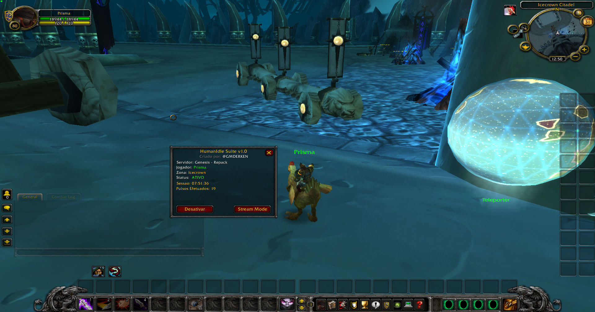
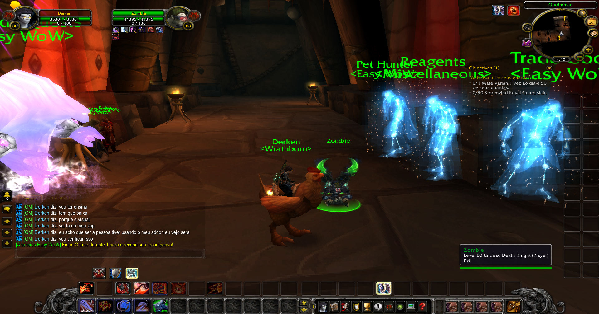
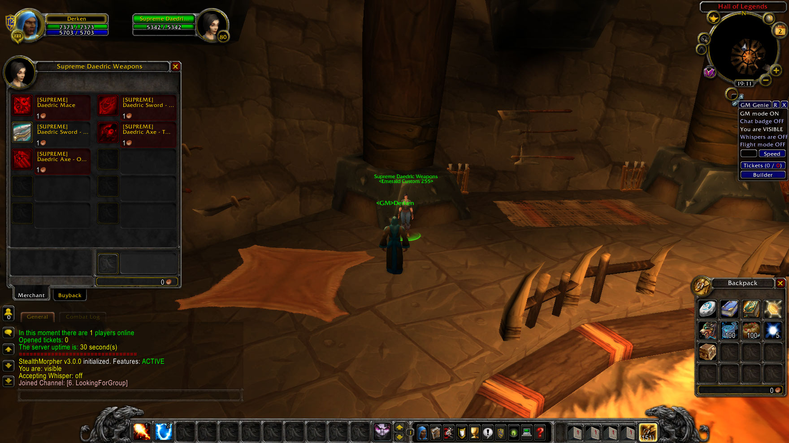
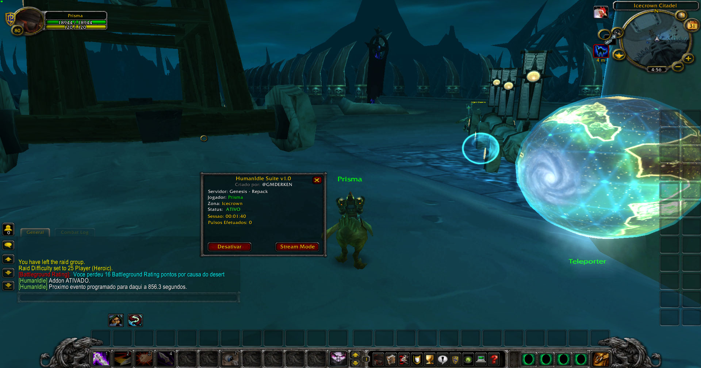

# Emerald i80 Repack — WoW 3.3.5a

> Servidor pronto para testes locais em **World of Warcraft: Wrath of the Lich King 3.3.5a (build 12340)**.
>
> **O cliente do WoW não está incluído.** Você precisa obter separadamente um cliente 3.3.5a compatível.

[⬇️ **BAIXAR O REPACK (Releases)**](https://github.com/ronilsondesouza045-beep/emerald-i80-repack-335a/releases/latest)

## Informações rápidas

| Item | Informação |
| --- | --- |
| Versão do jogo | WotLK 3.3.5a — build 12340 |
| Tipo do pacote | Somente servidor (server-only) |
| Sistema | Windows |
| Realmlist local | `set realmlist 127.0.0.1` |
| Conta administrador/GM | `q` |
| Senha administrador/GM | `q` |
| Inicialização | `1_ABRIR_SERVIDOR_COMPLETO.bat` |

> A conta `q` / `q` existe para facilitar o primeiro teste local. Se você abrir o servidor para outras pessoas ou para a Internet, **troque essa senha antes** e revise as permissões GM.

## Sobre esta versão

Esta versão reúne o estado estável do Emerald i80 após os testes e correções realizados no servidor.

- Correção aplicada ao falso kick/desconexão observado na validação compartilhada de chat/addon.
- O problema foi reproduzido durante a sincronização do addon Transmorpher.
- Depois da correção, o cenário foi testado com três contas simultâneas sem reproduzir a queda anterior.
- As configurações e o banco de dados do repack foram preservados.
- O pacote não inclui o cliente do WoW.
- Patches visuais customizados usados em testes antigos não fazem parte deste download.

> A compatibilidade confirmada refere-se aos testes feitos neste repack; ela não garante o funcionamento de todo addon existente.

## Screenshots do projeto

As imagens abaixo são registros antigos do desenvolvimento e dos testes do Emerald i80. Alguns itens, NPCs, addons ou efeitos visuais mostrados podem não fazer parte do pacote server-only atual.

### Painel e ferramentas de GM



### Teste de evento em Orgrimmar



### NPC e armas customizadas em teste antigo



### Jogabilidade durante os testes



## Como instalar e jogar

1. Abra a página de [Releases](https://github.com/ronilsondesouza045-beep/emerald-i80-repack-335a/releases/latest).
2. Baixe o arquivo ZIP do repack.
3. Extraia a pasta `REPACK_EMERALD_I80` para um local com espaço livre.
4. Execute `1_ABRIR_SERVIDOR_COMPLETO.bat`.
5. Aguarde o MySQL, o AuthServer e o WorldServer iniciarem.
6. No seu cliente WoW 3.3.5a, configure o realmlist:

   ```text
   set realmlist 127.0.0.1
   ```

7. Abra `Wow.exe` e entre com:

   ```text
   Usuário: q
   Senha: q
   ```

O repack também contém `CONFIGURAR_WOW_LOCAL.bat`, que faz backup do `realmlist.wtf` anterior e configura o endereço local automaticamente.

Para criar outra conta sem privilégios de administrador, ligue o servidor e execute `CRIAR_CONTA_NORMAL.bat`.

## Tamanho do download

O ZIP atual tem aproximadamente **1,0 GB** porque já leva o banco de dados completo, executáveis do servidor e os dados de mapas necessários para o WorldServer. A maior parte do tamanho não é formada pelo cliente do WoW.

É possível retirar alguns arquivos de desenvolvimento e logs para criar uma edição menor, mas isso deve ser publicado como um novo arquivo e testado antes. Remover bancos, DBCs, maps, vmaps ou mmaps sem validação pode impedir o servidor de iniciar ou quebrar criaturas, colisões e movimentação.

## Integridade

SHA-256 do `worldserver.exe` deste release:

```text
F90B54ECEF2CA6D996E8DD8E262428896D20967280291F6D227370B124CBB5B6
```

O arquivo `SHA256.txt` anexado ao release contém o hash do ZIP completo.

## Uso e segurança

Este projeto é disponibilizado para testes locais, estudo e aprendizado.

- Não inclui o cliente World of Warcraft.
- Não é afiliado nem endossado pela Blizzard Entertainment.
- Não exponha a porta do MySQL para a Internet.
- Troque as credenciais padrão e revise as permissões GM antes de disponibilizar o servidor externamente.
- Faça backup da pasta antes de alterar o banco de dados ou remover arquivos.

## Versão

**v1.0.0**
